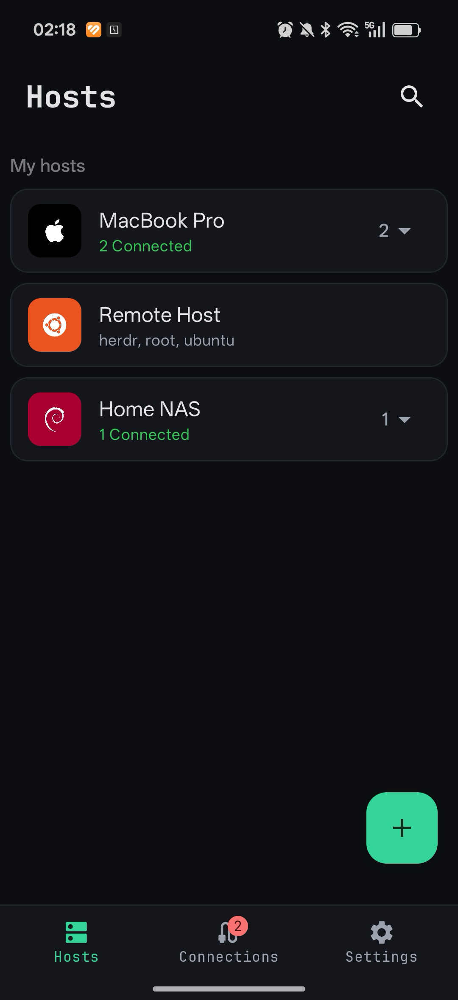
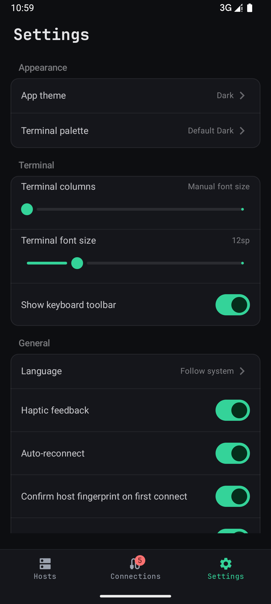
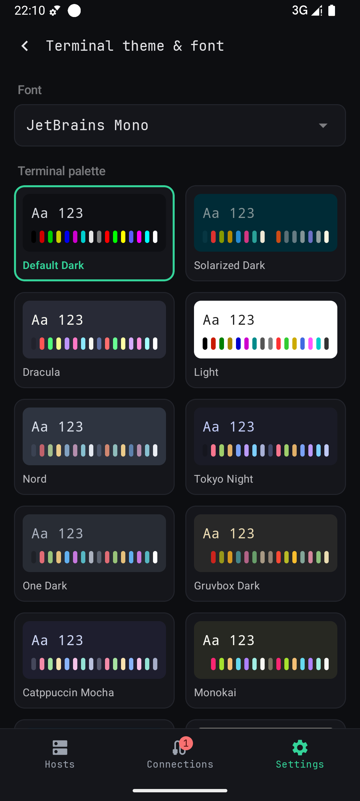
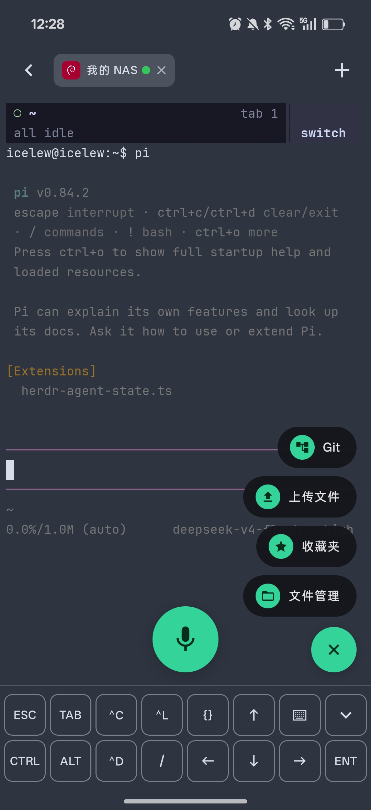
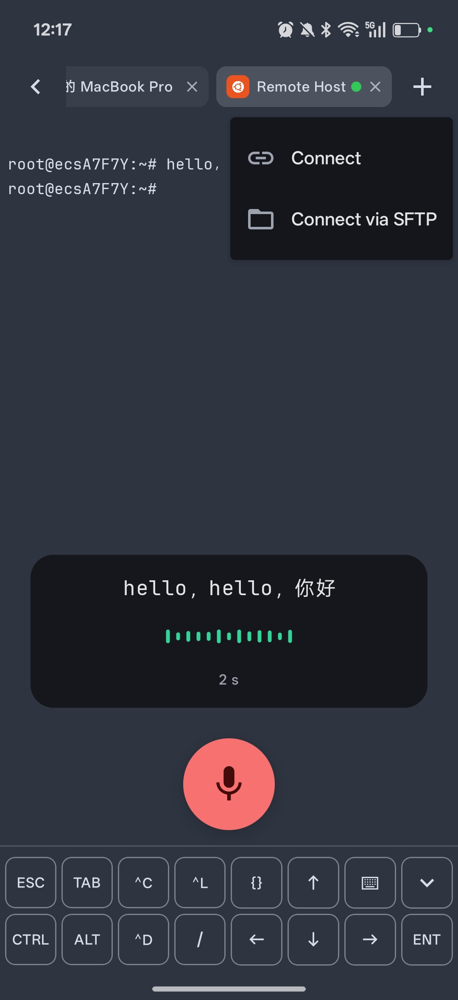
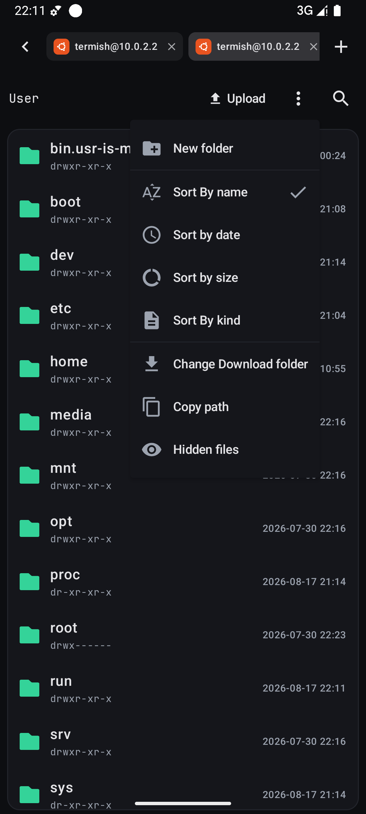
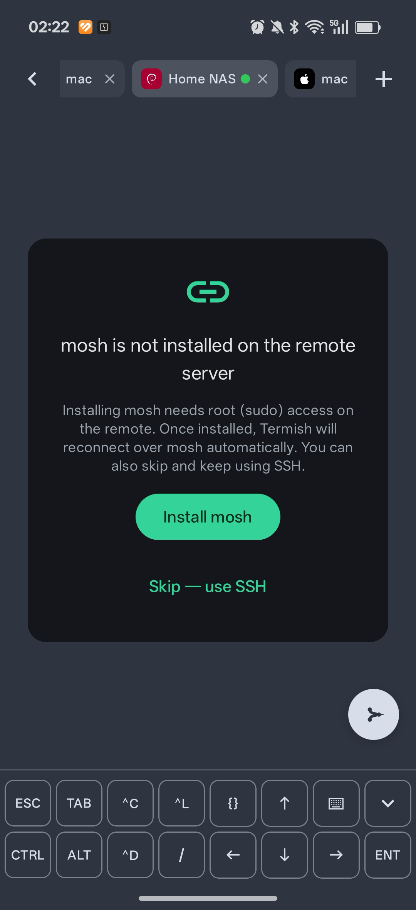
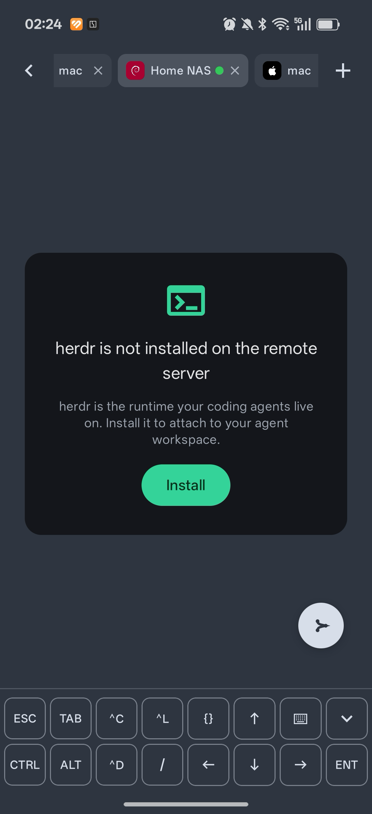
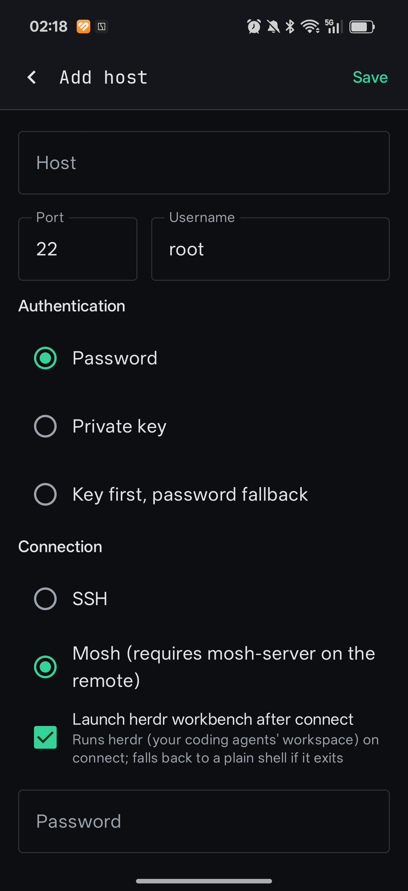
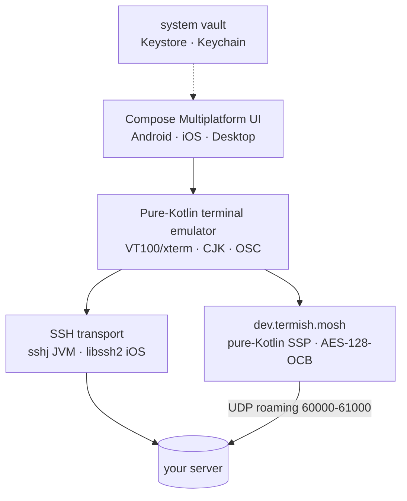

# Termish

> Mosh + SSH mobile terminal for your phone — sessions that survive WiFi
> switches and roaming, and the pocket entry point to any TUI agent
> (herdr · codex · claude). **AI-friendly by design**: watch agents work,
> talk to them, review their output — from your pocket. 极致手机端 Mosh + SSH 终端。

[中文文档](README.zh-CN.md) 丨 [🌐 官网 termish.dev](https://termish.dev)

[](https://termish.dev)
[](https://kotlinlang.org)
[](https://www.jetbrains.com/compose-multiplatform/)
[]()
[](LICENSE)

<p>
  
  
  
</p>
<p>
  
  
  
</p>
<p>
  
  
  
</p>

<p>
  <a href="https://github.com/icelum/termish/releases/latest">
    
  </a>
  <a href="https://github.com/icelum/termish/releases/latest">
    
  </a>
  <a href="#build--test">
    
  </a>
</p>

## Download

Get the latest build from the [Releases page](https://github.com/icelum/termish/releases/latest):

- **Android** — signed APK (sideload: allow “install unknown apps”) and AAB
- **Desktop (macOS / Linux / Windows)** — DMG / DEB / MSI installers
- **iOS** — not published; build locally (see [Build & Test](#build--test))

Every release ships with SHA-256 checksums. Prefer a debug APK from CI
artifacts? See [Install](#install).

### Also on the web

Prefer a browser? **Termish Web** is the same agent windows with nothing to
install — global agent view, read-only session sharing, and a local host that
needs no sshd. `npm install -g @termish/web` → [termish.dev/web](https://termish.dev/web)

## Table of Contents

- [Download](#download)
- [Why Termish?](#why-termish)
- [Features](#features)
- [Install](#install)
- [Quick Start](#quick-start)
- [Documentation](#documentation)
- [Build & Test](#build--test)
- [Security Model](#security-model)
- [Known Limitations](#known-limitations)
- [Roadmap](#roadmap)
- [Contributing](#contributing)

## Why Termish?

Termish tells two stories that plain SSH clients can't.

**The pocket front door to your agents.** herdr is the always-on room where your
AI agents live on the server; Termish is the front door you carry in your
pocket. Tap a host and you're in a real window into codex, claude, herdr, vim,
htop — from anywhere, no extra daemon on your phone.

**Mosh-first: sessions that survive the network.** SSH guarantees
compatibility, Mosh keeps the session alive through WiFi switches and roaming.
Local echo prediction keeps typing snappy at high RTT; a lock screen or an app
switch never costs you your session.

Under the hood, the terminal engine is pure Kotlin and renders natively — no
webview wrapper, no JS bridge: a **pure-Kotlin terminal emulator** and a
**Compose Multiplatform UI** shared across platforms, with the SSH transport
swapped per platform against battle-tested libraries (sshj on JVM, libssh2 on
iOS). All the effort goes where it matters — the terminal experience.

- **Local-first & private** — Termish connects straight to your servers: no
  account, no cloud sync, no telemetry, no third-party hop. Secrets live only
  in the platform vault (Keystore / Keychain); your agent sessions belong to
  you
- **Open source & free forever** — MIT licensed, auditable, no subscriptions,
  no feature walls
- **Composition-safe IME** — pinyin, kana and hangul never leak to the wire;
  candidate bars fully work (see below)
- **Touch-first TUI input** — fixed CTRL/ALT/ESC toolbar, tap/drag mapped to
  terminal mouse events, so agent TUIs (herdr/codex/claude/vim/htop) stay
  usable on a phone
- **Native on every platform** — no webview on your phone, no Electron on your
  desktop; one shared Kotlin codebase; long-lived agent sessions stay cool and
  light on battery
- **Terminal-first design** — the emulator, not the transport, is the core asset
- **Built for real workflows** — tmux-friendly sessions, background keep-alive,
  leave-and-return session restore, zero Material-default looks

### Architecture at a glance



### CJK input, done right

On phones, browser-rendered terminals have a hard time with CJK IMEs: composing
text gets swallowed or leaked byte-by-byte, and candidate bars often never
appear. Termish's input pipeline is designed around composition from day one:

- IME **composing text never reaches the wire** — only committed text is diffed
  (common-prefix) and sent; pinyin can't pollute the remote line
- `KeyboardType.Text` keeps Chinese candidate bars fully functional
- Backspace semantics are split: composing → IME deletes pinyin; committed → `0x7f`
  key events reach the remote even with an empty local buffer
- Wide chars are 2-cell across buffer, renderer and selection — tails inherit the
  head's colors, so CJK on colored status bars (e.g. agent TUIs) renders cleanly

Browser terminals excel at their own place — that's why Termish Web runs in the
browser for desktop workflows while the phone stays native.

## Features

**Terminal emulator**
- VT100/xterm escape sequences, UTF-8, wide chars (CJK), alt screen, scrollback
- True color / 256 / ANSI-16, bold, underline, inverse; bundled **JetBrains Mono**
  (identical metrics on every device — no OEM font surprises)
- OSC 8 hyperlinks, OSC 52 clipboard, OSC 10/11/12 color queries, bracketed
  paste (2004), DEC special graphics, DECSCUSR cursor styles
- DECRQSS/DECRQM/DA/DA2 responses, focus events (1004), alternate scroll (1007),
  mouse reporting in X10 / SGR (1006) / urxvt (1015) formats
- Canvas rendering with inertial scrolling, double-tap word select, long-press copy

**Sessions**
- **Multi-session per host** (Termius style): every open starts a fresh session —
  all sessions of a host (plus SFTP) sit side by side in a terminal **tab bar**;
  switch, add, or close tabs, each with its own buffer and status dot
- Session manager with a **Connections tab** — leave a terminal without
  disconnecting, come back to the exact buffer; host cards show a live
  session-count badge
- **Session restore**: on restart, the session list comes back (disconnected,
  tap to reconnect)
- **Foreground service + wakelock** (Android) keeps sessions alive in background
- iOS: backgrounding suspends the app, so the socket drops — returning to the
  app auto-reconnects active sessions and restores the buffer (pair with
  `tmux`/herdr for a server-side session that survives any client drop)
- Auto-reconnect with exponential backoff; startup command per host
  (`tmux new -A -s main` for true server-side session persistence)
- Real-time connection status in the terminal header

**Mosh**
- **Guided install**: connecting in Mosh mode with no `mosh-server` on the
  remote pops a bootstrap card — one-tap install (sudo password is sent over
  the encrypted SSH channel for this install only, never stored), live apt
  install log, auto-reconnect over mosh when done; skip to keep using SSH
- SSH bootstrap: `mosh-server` is started over SSH, its UDP port/key parsed, then
  a **pure-Kotlin mosh client** (`dev.termish.mosh`: AES-128-OCB, SSP state sync,
  zlib fragmentation) speaks UDP directly — no GPL native binary needed.
- Per-host **fixed UDP port** for NAS / router port-forwarding setups
- **Theme sync**: your phone's terminal palette (OSC 4/10/11 answers) is injected
  into the Mosh stream, so TUIs like herdr render with your theme instead of the
  host's terminal theme
- Startup command & auto-reconnect work for Mosh sessions too; UDP roaming
  survives Wi-Fi ↔ cellular switches
- **Local echo prediction**: keystrokes render instantly on a predicted overlay
  and are reconciled by echo acks — typing stays snappy at high RTT

**SFTP file manager**
- File browser with upload / streaming download / recursive folder download,
  breadcrumb navigation with back-as-history, recursive cross-directory search
- **Multi-select** (long-press): batch download / delete / copy paths;
  delete (recursive for folders) & rename; pull-to-refresh; folder favorites
  (persisted per host, reachable from the terminal menu) with one-tap jump;
  date grouping (Today / This week / Earlier); empty state
- **Text & Markdown preview**: streams only the first 512 KB, auto-detects
  binary files; **Markdown renders** (headings, code blocks, inline styles,
  lists, quotes) with a preview ⇄ source toggle — no library, pure Kotlin
- 20 color-coded file-type icons (APK, keys, archives, PDF, spreadsheets, …)
- Download: floating progress card + completion notification (Android taps to
  open); Android 10+ saves straight to the Download folder (auto-rename, no
  save-as dialog), iOS exports to Files, desktop file chooser; browsing path
  persists across restarts (saved on every navigation)

**Input & terminal tools**
- Fixed two-row key toolbar: `CTRL ALT ESC TAB ⌃C ↑ ⌃L ⌨` / `⌃D PST / ⌃E ← ↓ → ENT`
- Sticky CTRL/ALT modifiers combine with the system keyboard (⌃A/⌃E/⌃R …);
  composition-safe IME handling; backspace works even with an empty input buffer
- When a TUI enables mouse reporting, touch gestures map to terminal mouse
  events (tap = click, drag = motion / wheel) — herdr/vim/htop panes stay
  usable on a touchscreen
- **Corner tool menu** (`+`): upload files (choose current dir / /tmp, stream
  over SFTP, remote path auto-typed into the terminal), file manager (opens
  SFTP at the terminal's working directory), favorites, Git panel
- **Quick commands** panel: insert or run snippets; empty state lets you add
  one right there

**Voice input** (bring-your-own ASR)
- Hold nothing — **one tap on the center mic button** to speak; live
  transcription appears on screen with a sound wave and a timer
- Auto-send after ~2 s of silence (or tap the red button); drag the button
  anywhere, long-press or tap the reset badge to return it to center
- **Plug-in ASR providers**: Volcano Engine streaming ASR ships as the first
  engine; add/edit/remove providers (name, key, resource ID) in Settings —
  keys live in the platform vault; new engines plug in behind one interface

**App**
- Hosts / Connections / Settings tabs; host search, tags, quick commands,
  password / private-key / encrypted-private-key (PKCS#8, legacy PEM, OpenSSH —
  passphrase asked once per connection, never persisted) & keyboard-interactive
  auth, TOFU host-key verification
- **Bilingual UI** — Chinese / English / follow system, switchable in Settings
- **About section in Settings** — version, website, contact email
- Secrets in platform stores: **Android Keystore (AES-GCM) / iOS Keychain**
- Design system: zinc neutrals + emerald accent, JetBrains Mono titles,
  dark & light themes; 12 built-in terminal palettes (Default, Solarized, Dracula,
  Nord, Tokyo Night, Gruvbox, Catppuccin Mocha, Monokai, …)
- Font size by sp or **target columns** (e.g. 120 cols — desktop-like density)
- Fine-grained tuning in Settings: haptic feedback, cursor blink, OSC 52
  clipboard toggle, keepalive interval, auto-reconnect, TOFU prompt on first use

## Install

- **Android**: download the signed APK/AAB from the Releases page (or the debug
  APK from CI artifacts).
- **Desktop**: DMG / DEB / MSI installers from the Releases page.
- **iOS**: not published in CI — build locally:
  `make ios-native && make ios-framework`, then open `iosApp/iosApp.xcodeproj`
  in Xcode and run on a simulator or device.

## Quick Start

1. **Add a host** — Hosts tab → `+`: name, hostname, port, username, and an auth
   method (password / private key / key-or-password). Tags and quick commands
   are optional.
2. **Connect** — tap the host card. On first connect you confirm the server's
   host key fingerprint (TOFU); after that it is verified automatically.
   Tap the same host again to open another session — tabs switch in the
   terminal page.
3. **Type** — tap the canvas to raise the keyboard. Use the key toolbar for
   CTRL/ALT/ESC and arrows; PST pastes (bracketed-paste aware).
4. **Mosh** — set the host's Connection Mode to Mosh. If `mosh-server` is
   missing on the remote, a **guided install** card appears: one-tap install
   (sudo password sent once, never stored), live install log, auto-reconnect
   over mosh when done; you can also skip and stay on SSH. Behind NAT, set a
   fixed UDP port on the host and forward it. Enable "Sync terminal theme" for
   TUIs like herdr.
5. **Keep sessions alive** — set a startup command like `tmux new -A -s main`
   for server-side persistence. Leaving the terminal page keeps the session
   running in the background (Android foreground service); the Connections tab
   re-enters it with the exact buffer.
6. **herdr workspace** — turn on the host's herdr mode (pocket entry to your
   agents). If herdr is missing on the remote, a **guided install** card pops:
   one-tap install (official script), live install log on the card, straight
   into your agent workspace when done.
7. **SFTP** — `+` → Connect via SFTP: browse, upload, download files and whole
   folders.

## Documentation

Deep dives for contributors (English summary at the top of each file):

- [docs/architecture.md](docs/architecture.md) — module layout, expect/actual
  seams, threading model
- [docs/terminal-emulator.md](docs/terminal-emulator.md) — buffer model
  (COW / line-level sync), supported escape-sequence matrix, renderer notes
- [docs/mosh.md](docs/mosh.md) — SSP implementation, crypto, prediction engine,
  roaming
- [docs/ssh-transport.md](docs/ssh-transport.md) — SshSession contract, sshj
  and libssh2 engines, auth chain, mosh bootstrap, system probing
- [docs/sftp.md](docs/sftp.md) — SftpSession contract, both engine
  implementations, longentry fallback, recursive download
- [docs/input-pipeline.md](docs/input-pipeline.md) — IME composition pipeline,
  backspace semantics, touch → mouse-event mapping
- [crypto/README.md](composeApp/src/commonMain/kotlin/dev/termish/crypto/README.md) —
  threat model of the pure-Kotlin crypto primitives

## Build & Test

```bash
# Unit tests (crypto RFC vectors + terminal emulator + mosh)
./gradlew :composeApp:desktopTest

# Transport integration tests (auto-starts the local test sshd; tests self-detect
# sshd on 127.0.0.1:22222 and SKIP gracefully when absent)
./gradlew testIntegration

# Android APK
./gradlew :composeApp:assembleDebug

# iOS native deps (one-time): OpenSSL + libssh2 → iosApp/native/{include,lib/device,lib/sim}
./scripts/build-ios-native.sh

# Kotlin framework + host app
./gradlew :composeApp:linkDebugFrameworkIosSimulatorArm64
./gradlew :composeApp:linkDebugFrameworkIosArm64
open iosApp/iosApp.xcodeproj

# Local test sshd (port 22222, generates ed25519 keys)
./scripts/test-sshd.sh
```

Convenience aliases (`make help` for the full list): `make run`, `make test`,
`make test-integration`, `make lint`, `make release`.

Unit tests cover crypto RFC vectors, the terminal emulator, and Mosh;
transport integration tests self-detect a local sshd and SKIP (not fail)
when it's absent.

Stack: Kotlin 2.1.21 · Compose Multiplatform 1.8.1 · AGP 8.9.2 · Gradle 8.14.2 ·
kotlinx-coroutines 1.10.2 · sshj 0.40.0 · libssh2 1.11.1 + OpenSSL 3.0.16

## Security Model

- Passwords & private keys never touch disk in plaintext — Android Keystore
  (AES-GCM) / iOS Keychain / dev-only file store
- Host keys: TOFU (trust on first use) with fingerprint confirmation; strict
  verification for known hosts
- No telemetry, no analytics, no network calls except your SSH connections

Security disclosures and reporting: see [SECURITY.md](SECURITY.md).

## Known Limitations

- **Android 15 foreground-service timeout**: the 6-hour `dataSync` limit ends
  background keepalive; returning to the app auto-reconnects
- **iOS backgrounding**: the app is suspended and sockets drop; active sessions
  auto-reconnect on return — pair with `tmux`/Mosh for server-side continuity
- **Desktop secrets** live in a plaintext properties file under `~/.termish`
  (dev/test harness only — mobile builds use Keystore/Keychain)
- **iOS builds** run on the maintainer's private Xcode Cloud (see
  `iosApp/ci_scripts/ci_post_clone.sh`); the public GitHub Actions CI only
  covers Android + desktop. Contributors verify iOS changes locally:
  `make ios-native && make ios-framework`, then build & run from Xcode

## Roadmap

- [x] Pure-Kotlin Mosh client (incl. local echo prediction)
- [x] Session manager — multi-session tabs, Connections, auto-reconnect
- [x] SFTP & secret/known-hosts management
- [ ] **Agent-friendly** — herdr/codex session takeover, status badges,
  task notifications, phone approve
- [ ] Connection — port forwarding, ProxyJump, `~/.ssh/config` import
- [ ] Snippets
- [ ] Voice input
- [ ] tmux session list
- [ ] E2EE cross-device sync
- [ ] Later: landscape dual-pane, kana/hangul IME, deep links

## Contributing

Issues and PRs are welcome — see [CONTRIBUTING.md](CONTRIBUTING.md) for the
full guide. A few pointers:

- `term/` is pure Kotlin with no platform deps — add a unit test for any escape
  sequence or buffer behavior you touch (`commonTest/`)
- Keep platform code behind the `ssh/SshSession` and `util/` expect/actual seams
- Design tokens live in `ui/theme/` — no ad-hoc dp/alpha values in new UI code
- README.md and README.zh-CN.md are kept in sync; behavior changes to `term/`
  or `mosh/` update the matching docs file

## Acknowledgments

| Project | License | Used for |
|---------|---------|----------|
| [JetBrains Mono](https://github.com/JetBrains/JetBrainsMono) | [OFL-1.1](LICENSES/JetBrainsMono-OFL.txt) | bundled terminal font |
| [Noto Sans SC](https://github.com/notofonts/noto-cjk) | [OFL-1.1](LICENSES/Noto-OFL.txt) | bundled CJK font (iOS Chinese fallback) |
| [Fira Code](https://github.com/tonsky/FiraCode) / [Source Code Pro](https://github.com/adobe-fonts/source-code-pro) / [PT Mono](https://fonts.google.com/specimen/PT+Mono) | [OFL-1.1](LICENSES/FiraCode-OFL.txt) | bundled terminal fonts (optional) |
| [Ubuntu Mono](https://design.ubuntu.com/font/) | [UFL-1.0](LICENSES/UbuntuFontLicense-1.0.txt) | bundled terminal font (optional) |
| [sshj](https://github.com/hierynomus/sshj) | [Apache-2.0](LICENSES/Apache-2.0.txt) | JVM SSH engine |
| [BouncyCastle](https://www.bouncycastle.org) | [MIT-style](LICENSES/BouncyCastle-MIT.txt) | JVM crypto |
| [libssh2](https://libssh2.org/) | [BSD-3-Clause](LICENSES/libssh2-BSD.txt) | iOS SSH engine |
| [OpenSSL](https://www.openssl.org/) | [Apache-2.0](LICENSES/Apache-2.0.txt) | iOS crypto |
| [Kotlin](https://kotlinlang.org/) / [Compose Multiplatform](https://www.jetbrains.com/compose-multiplatform/) | Apache-2.0 | language & UI |
| [kotlinx-coroutines](https://github.com/Kotlin/kotlinx.coroutines) / [kotlinx-serialization](https://github.com/Kotlin/kotlinx.serialization) / [multiplatform-settings](https://github.com/russhwolf/multiplatform-settings) | Apache-2.0 | concurrency / JSON / storage |

## See also

- [Termish Web](https://termish.dev/web) — the same herdr windows in any
  browser: global agent view, read-only sharing, a local host without sshd
  (`npm install -g @termish/web`)

## License

Termish is released under the [MIT License](LICENSE).
Bundled JetBrains Mono is licensed separately under
[OFL-1.1](LICENSES/JetBrainsMono-OFL.txt).

Third-party component licenses: see [NOTICE](NOTICE) and the
[LICENSES/](LICENSES/) directory.
