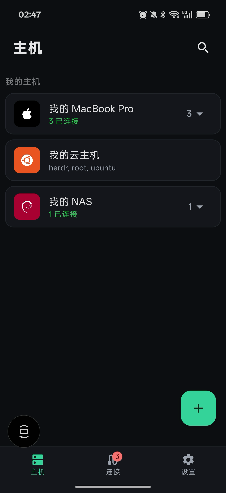
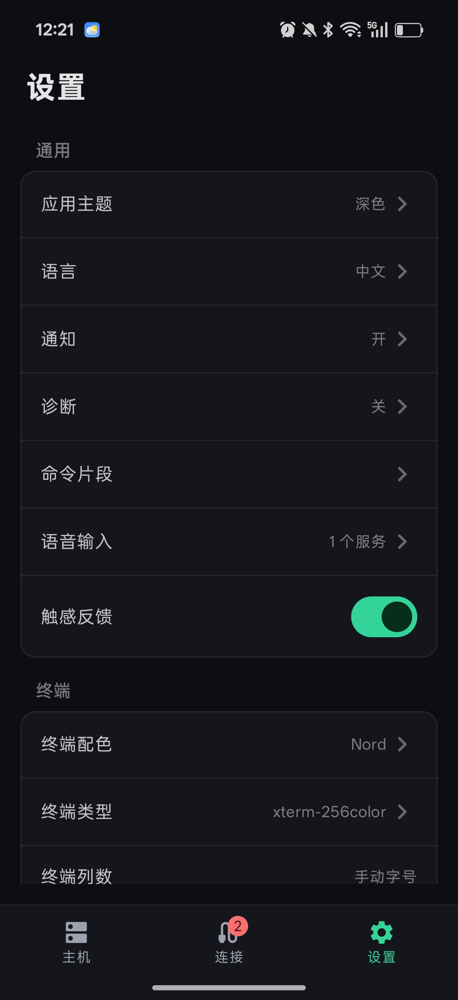
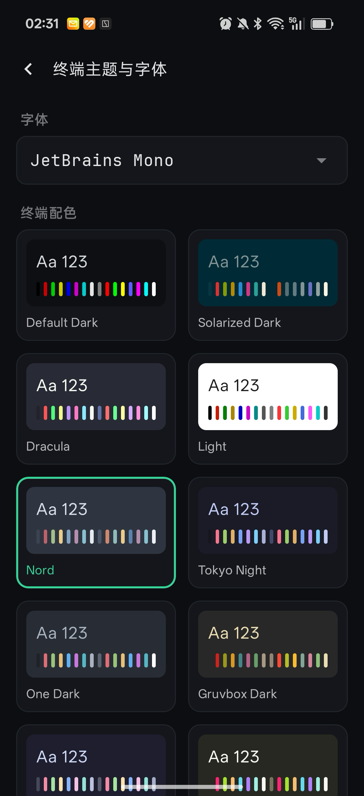
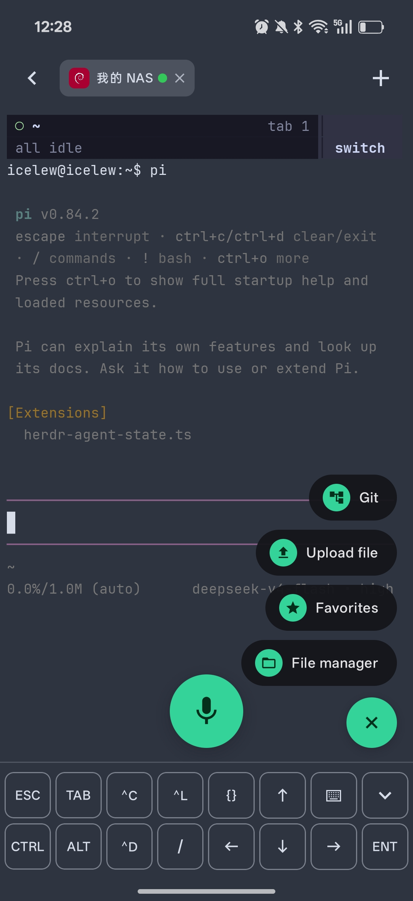
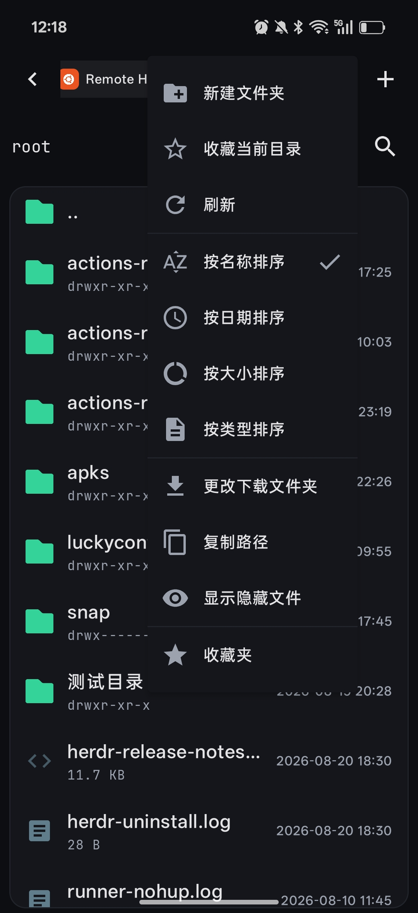
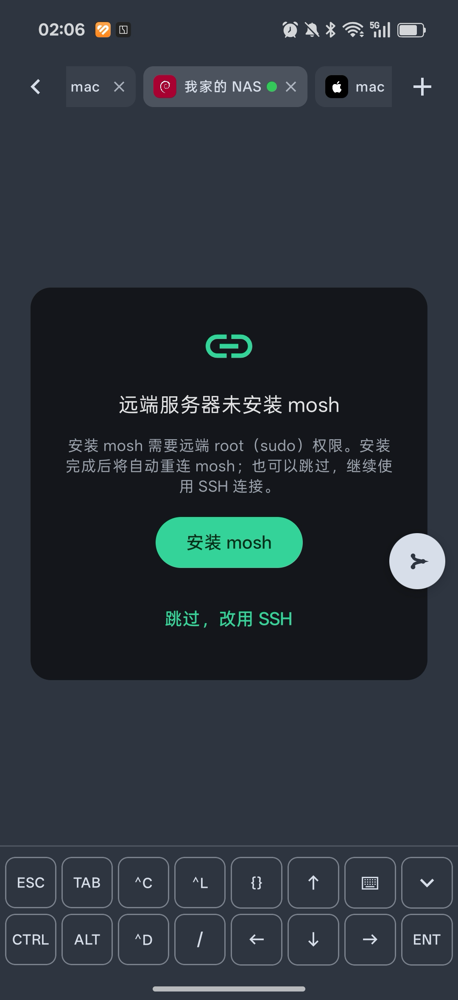
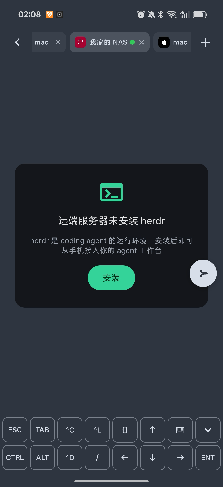
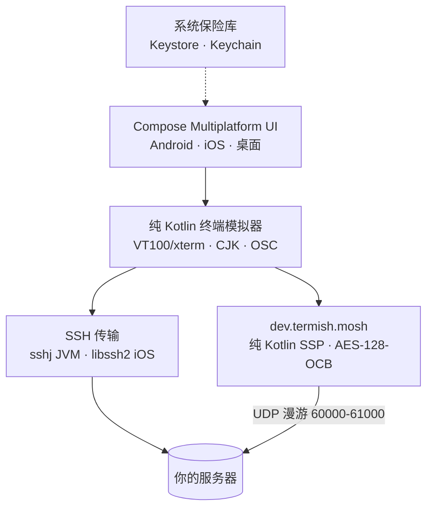

# Termish

> 手机上的 Mosh + SSH 终端——换网、漫游不掉线，任意 TUI agent（herdr · codex · claude）的口袋入口。
> Mosh + SSH mobile terminal for your phone — sessions that survive roaming,
> the pocket entry point to any TUI agent.

[English](README.md) 丨 [🌐 官网 termish.dev](https://termish.dev)

[](https://termish.dev)
[](https://kotlinlang.org)
[](https://www.jetbrains.com/compose-multiplatform/)
[]()
[](LICENSE)

<p>
  
  
  
</p>
<p>
  
  
  
</p>
<p>
  
  
</p>

<p>
  <a href="https://github.com/icelum/termish/releases/latest">
    
  </a>
  <a href="https://github.com/icelum/termish/releases/latest">
    
  </a>
  <a href="#构建与测试">
    
  </a>
</p>

## 下载

从 [Releases 发布页](https://github.com/icelum/termish/releases/latest) 获取最新构建：

- **Android** — 签名 APK（侧载需允许“安装未知来源应用”）与 AAB
- **桌面（macOS / Linux / Windows）** — DMG / DEB / MSI 安装包
- **iOS** — 未公开分发；本地构建（见 [构建与测试](#构建与测试)）

每个发布附 SHA-256 校验和。想要 CI 产物的 debug APK？见 [安装](#安装)。

### 也可以用浏览器

不想装 App？**Termish Web** 让同一批 agent 窗口免安装直达——全局 agent 视图、
只读会话分享、无需 sshd 的本地主机。`npm install -g @termish/web` →
[termish.dev/web](https://termish.dev/web)

## 目录

- [下载](#下载)
- [为什么是 Termish？](#为什么是-termish)
- [特性](#特性)
- [安装](#安装)
- [快速上手](#快速上手)
- [文档](#文档)
- [构建与测试](#构建与测试)
- [安全模型](#安全模型)
- [已知限制](#已知限制)
- [路线图](#路线图)
- [参与贡献](#参与贡献)

## 为什么是 Termish？

Termish 讲的是普通 SSH 客户端讲不了的两个故事。

**Agent 的口袋前门。** herdr 是 agent 在服务器上常驻的“房间”，Termish 是你随身带
的前门——点一下主机，就进入 codex、claude、herdr、vim、htop 的真实窗口。从任何
地方——手机上不用装额外常驻进程。

**Mosh 优先：会话在网络变化中存活。** SSH 保证兼容，Mosh 让会话在换网、漫游中
不掉线。本地回显预测让高延迟下打字依然跟手；锁屏、切 App 都不会丢掉会话。

底层上，终端引擎是纯 Kotlin、原生渲染——没有 webview 壳、没有 JS 桥：
**纯 Kotlin 终端模拟器** + 全平台共享的 **Compose Multiplatform UI**，SSH 传输
层按平台换用久经考验的库（JVM 用 sshj，iOS 用 libssh2）。全部精力花在最值得
的地方——终端体验。

- **本地优先、隐私设计**——直连你的服务器：无需账号、无云同步、无遥测、
  不经过任何第三方。密钥只进系统保险库（Keystore / Keychain）；
  你的 agent 会话只属于你
- **开源且永久免费**——MIT 协议、代码可审计、无订阅、无功能墙
- **组合态输入法一等公民**——拼音、假名、谚文永不上线，候选栏完整可用（见下）
- **触屏 TUI 输入**——固定 CTRL/ALT/ESC 工具行，tap/drag 映射为终端鼠标事件，
  agent TUI（herdr/codex/claude/vim/htop）在手机上顺手可用
- **每个平台都原生**——手机上无 webview、桌面上无 Electron，一套共享 Kotlin
  代码库；长时 agent 会话不发热、不费电
- **终端优先**——模拟器而非传输层才是核心资产
- **为真实工作流而生**——tmux 友好会话、后台保活、离开-回来会话恢复、
  告别 Material 默认观感

### 架构一览



### 中文输入，做到位

手机上的浏览器渲染终端处理中文输入法很吃力：组合文本被吞或逐字节泄漏，候选栏
经常弹不出来。Termish 的输入管线从第一天起就围绕组合态设计：

- 输入法**组合文本（拼音）永不上线**——只有提交后的文本才做公共前缀 diff 发送，
  拼音不可能污染远端行
- `KeyboardType.Text` 保证中文候选栏完全可用
- 退格语义拆分：组合态 → IME 自己删拼音；已提交 → `0x7f` 直达远端，
  本地缓冲为空也删得掉远端内容
- 宽字符在缓冲、渲染、选择全链路按 2 格处理——尾巴继承头部颜色，
  彩色状态条（如 agent TUI）上的中文渲染干净利落

浏览器终端自有其用武之地——这正是 Termish Web 选择在浏览器里服务桌面工作流、
而手机保持原生渲染的原因。

## 特性

**终端模拟器**
- VT100/xterm 转义序列、UTF-8、宽字符（CJK）、备用屏、滚动回看
- 真彩 / 256 色 / ANSI-16、粗体、下划线、反显；内置 **JetBrains Mono**
  （每台设备度量一致——没有 OEM 字体惊喜）
- OSC 8 超链接、OSC 52 剪贴板、OSC 10/11/12 颜色查询、bracketed paste（2004）、
  DEC 特殊图形、DECSCUSR 光标样式
- DECRQSS/DECRQM/DA/DA2 应答、焦点事件（1004）、备用屏滚动（1007）、
  X10 / SGR（1006）/ urxvt（1015）三种鼠标上报
- Canvas 渲染 + 惯性滚动，双击选词，长按复制

**会话**
- **同主机多会话**（Termius 风格）：每次打开都是新会话——同一主机的全部会话
  （外加 SFTP）平级显示在终端 **tab 栏**，随意切换 / 新建 / 关闭，
  各自持有独立缓冲与状态点
- 会话管理器 + **连接 tab**——离开终端不断连，回来就是原来的缓冲；
  主机卡片实时显示会话数徽标
- **会话恢复**：重启后会话列表原样回来（断开状态，点击重连）
- **前台服务 + wakelock**（Android）后台保活
- iOS：退后台即挂起、socket 断开——回前台自动重连活跃会话并恢复缓冲
  （配合 `tmux`/herdr 做服务端会话，任何客户端掉线都不怕）
- 指数退避自动重连；每主机启动命令（`tmux new -A -s main` 实现真正的
  服务端会话持久化）
- 终端页头实时连接状态

**Mosh**
- **引导安装**：Mosh 模式连接时发现远端未装 `mosh-server`，自动弹引导卡——
  一键安装（sudo 密码仅本次经加密 SSH 发送、不存储），实时显示 apt 安装日志，
  装完自动重连 mosh；不想装可跳过，继续用 SSH
- SSH 引导：经 SSH 启动 `mosh-server`、解析 UDP 端口与密钥，然后**纯 Kotlin
  mosh 客户端**（`dev.termish.mosh`：AES-128-OCB、SSP 状态同步、zlib 分片）
  直连 UDP——无需任何 GPL 原生二进制
- 每主机**固定 UDP 端口**，适配 NAS / 路由器端口转发
- **主题同步**：把手机终端配色（OSC 4/10/11 应答）注入 Mosh 流，
  herdr 等 TUI 按你的主题而非宿主机主题渲染
- 启动命令与自动重连同样适用于 Mosh；UDP 漫游扛 Wi-Fi ↔ 蜂窝切换
- **本地回显预测**：按键在预测浮层上即时渲染，echo ack 到达后收编——
  高 RTT 下打字依然跟手

**SFTP 文件管理器**
- 文件浏览：上传 / 流式下载 / 目录递归下载，面包屑 + 历史回退导航，跨目录递归搜索
- **多选**（长按进入）：批量下载 / 删除 / 复制路径；删除（目录递归）与重命名；
  下拉刷新；**目录收藏**（按主机持久化，终端菜单可直达）；按「今天 / 本周 / 更早」分组；空态
- **文本与 Markdown 预览**：只读前 512 KB、自动识别二进制；**Markdown 渲染展示**
  （标题 / 代码块 / 行内样式 / 列表 / 引用），预览 ⇄ 源码一键切换（零依赖纯 Kotlin 渲染器）
- 20 类彩色文件类型图标（APK / 证书密钥 / 压缩包 / PDF / 表格…）
- 下载：右下角进度卡片 + 完成通知（Android 点击打开）；Android 10+ 直接存下载目录、
  iOS 导出到文件、桌面文件选择器；浏览路径每次导航即时持久化（重启回到上次目录）

**输入与终端工具**
- 固定两行功能键工具栏：`CTRL ALT ESC TAB ⌃C ↑ ⌃L ⌨` / `⌃D PST / ⌃E ← ↓ → ENT`
- 粘性 CTRL/ALT 与系统键盘组合（⌃A/⌃E/⌃R …）；输入法组合态安全（拼音/假名不上线）；
  输入框为空时退格也能删远端
- TUI 鼠标上报时，触摸映射为终端鼠标事件（点按=点击，拖动=移动/滚轮）——
  herdr/vim/htop 在手机上保持可用
- **右下角工具菜单（+）**：上传文件（当前目录 / /tmp，SFTP 流式上传，
  传完自动把远端路径输入终端）、文件管理（打开 SFTP 并定位到终端工作目录）、
  收藏夹、Git 面板
- **快捷命令面板**：插入/执行片段；空态也能直接新建命令
- 全局统一品牌提示样式（深色圆角 Snackbar + 翠绿操作）

**语音输入**（自带 ASR，可插拔）
- **点一下屏幕水平居中的麦克风按钮**即开始说话；实时转写文字上屏 +
  声波动画 + 计时；静音约 2 秒自动发送（或点红色按钮结束）
- 按钮可拖到任意位置，长按或点右上角重置角标回到中央
- **识别服务可插拔**：火山引擎流式识别为首个实现；设置页可添加/编辑/删除
  多个服务（名称 / Key / 资源 ID），Key 存平台安全存储；新增引擎只需实现统一接口

**应用**
- 主机 / 连接 / 设置三个 tab；主机搜索、标签、快速命令、
  密码 / 私钥 / 加密私钥（PKCS#8 / 传统 PEM / OpenSSH，连接时询问一次口令、
  不持久化）与 keyboard-interactive 认证、TOFU 主机密钥校验
- **双语界面**——中文 / 英文 / 跟随系统，设置页随时切换
- **设置页「关于」区**——版本号、官网、联系邮箱
- 密钥存平台安全存储：**Android Keystore（AES-GCM）/ iOS Keychain**
- 设计系统：zinc 中性色 + emerald 点缀，JetBrains Mono 标题，
  深色与浅色主题；内置 12 套终端配色（Default、Solarized、Dracula、Nord、
  Tokyo Night、Gruvbox、Catppuccin Mocha、Monokai 等）
- 字号按 sp 或**目标列数**（如 120 列——桌面级密度）
- 设置页细粒度可调：触觉反馈、光标闪烁、OSC 52 剪贴板开关、keepalive 间隔、
  自动重连、首次连接 TOFU 确认

## 安装

- **Android**：从 Releases 页下载签名 APK/AAB（或 CI 产物的 debug APK）。
- **桌面**：从 Releases 页下载 DMG / DEB / MSI 安装包。
- **iOS**：CI 不发包，需本地构建：`make ios-native && make ios-framework`，
  再用 Xcode 打开 `iosApp/iosApp.xcodeproj` 跑到模拟器或真机。

## 快速上手

1. **添加主机**——主机 tab → `+`：名称、主机名、端口、用户名、认证方式
   （密码 / 私钥 / 私钥或密码）。标签、快速命令可选。
2. **连接**——点主机卡片。首次连接需确认服务器主机密钥指纹（TOFU），
   之后自动校验。再次点同一主机即可再开一个会话，终端页内 tab 切换。
3. **输入**——点画布拉起键盘；功能键工具栏提供 CTRL/ALT/ESC 与方向键；
   PST 粘贴（自动识别 bracketed paste）。
4. **Mosh**——把主机的连接方式改为 Mosh。远端未装 `mosh-server` 时
   会自动弹出**引导安装**卡片：一键安装（sudo 密码仅本次发送、不存储），
   实时显示安装日志，装完自动重连；也可跳过继续用 SSH。
   NAT 环境下给主机固定一个 UDP 端口并做端口转发；用 herdr 等 TUI 时
   打开「同步终端主题」。
5. **会话保活**——设置启动命令如 `tmux new -A -s main` 做服务端持久化。
   离开终端页会话在后台保持运行（Android 前台服务）；连接 tab 可带着
   完整缓冲重新进入。
6. **herdr 工作台**——主机开启 herdr 模式（agent 口袋入口）。远端未装 herdr 时
   自动弹**引导安装**卡片：一键安装（官网脚本），卡片实时显示安装日志，
   装完直接进入 agent 工作台；日常用 herdr 等 TUI 时打开「同步终端主题」。
7. **SFTP**——`+` → Connect via SFTP：浏览、上传、下载文件与整个目录。

## 文档

面向贡献者的深水文档（每份开头有英文摘要）：

- [docs/architecture.md](docs/architecture.md) —— 模块布局、expect/actual 接缝、线程模型
- [docs/terminal-emulator.md](docs/terminal-emulator.md) —— 缓冲模型（COW/行级同步）、
  支持的转义序列矩阵、渲染笔记
- [docs/mosh.md](docs/mosh.md) —— SSP 实现、加密、预测引擎、漫游
- [docs/ssh-transport.md](docs/ssh-transport.md) —— SshSession 契约、sshj 与
  libssh2 双引擎、认证链、mosh 引导、系统探测
- [docs/sftp.md](docs/sftp.md) —— SftpSession 契约、双平台实现、longentry
  兑底、递归下载
- [docs/input-pipeline.md](docs/input-pipeline.md) —— IME 组合态管线、退格语义、
  触摸 → 鼠标事件映射
- [crypto/README.md](composeApp/src/commonMain/kotlin/dev/termish/crypto/README.md) ——
  纯 Kotlin 密码原语的威胁模型

## 构建与测试

```bash
# 单元测试（crypto RFC 向量 + 终端模拟器 + mosh）
./gradlew :composeApp:desktopTest

# 传输层集成测试（自动起本地测试 sshd；测试探测 127.0.0.1:22222，
# sshd 缺席时优雅 SKIP，跳过不算失败）
./gradlew testIntegration

# Android APK
./gradlew :composeApp:assembleDebug

# iOS 原生依赖（一次性）：OpenSSL + libssh2 → iosApp/native/{include,lib/device,lib/sim}
./scripts/build-ios-native.sh

# Kotlin framework + 宿主工程
./gradlew :composeApp:linkDebugFrameworkIosSimulatorArm64
./gradlew :composeApp:linkDebugFrameworkIosArm64
open iosApp/iosApp.xcodeproj

# 本地测试 sshd（22222 端口，自动生成 ed25519 密钥）
./scripts/test-sshd.sh
```

便捷别名（`make help` 查看全部）：`make run`、`make test`、`make test-integration`、
`make lint`、`make release`。

单元测试覆盖 crypto RFC 向量、终端模拟器与 Mosh；传输层集成测试自行探测
本地 sshd，缺席时 SKIP（不算失败）。

技术栈：Kotlin 2.1.21 · Compose Multiplatform 1.8.1 · AGP 8.9.2 · Gradle 8.14.2 ·
kotlinx-coroutines 1.10.2 · sshj 0.40.0 · libssh2 1.11.1 + OpenSSL 3.0.16

## 安全模型

- 密码与私钥绝不落盘明文——Android Keystore（AES-GCM）/ iOS Keychain /
  仅开发用途的文件存储
- 主机密钥：TOFU（首次使用信任）+ 指纹确认；已知主机严格校验
- 无遥测、无分析，除你的 SSH 连接外没有任何网络请求

安全披露与上报：见 [SECURITY.md](SECURITY.md)。

## 已知限制

- **Android 15 前台服务超时**：`dataSync` 6 小时上限结束后台保活；
  回到应用自动重连
- **iOS 后台挂起**：应用被挂起、socket 断开；活跃会话回前台自动重连——
  配合 `tmux`/Mosh 做服务端连续性
- **桌面端密钥**存放在 `~/.termish` 下的明文 properties 文件
  （仅开发/测试 harness——移动端构建用 Keystore/Keychain）
- **iOS 构建**走维护者私有的 Xcode Cloud（见
  `iosApp/ci_scripts/ci_post_clone.sh`）；公开 GitHub Actions CI 只覆盖
  Android + desktop。贡献者本地验证：`make ios-native && make ios-framework`，
  再用 Xcode 构建运行

## 路线图

- [x] 纯 Kotlin Mosh 客户端（含本地回显预测）
- [x] 会话管理——多会话 tab、Connections、自动重连
- [x] SFTP 与密钥/known_hosts 管理
- [ ] **Agent 友好支持**——herdr/codex 会话接管、状态徽章、任务通知、手机端批准
- [ ] 连接增强——端口转发、ProxyJump、`~/.ssh/config` 导入
- [ ] Snippets 片段库
- [ ] 语音输入
- [ ] tmux 会话列表
- [ ] E2EE 跨设备同步
- [ ] 后期：横屏双栏、kana/hangul 输入法、深链

## 参与贡献

欢迎提 Issue 和 PR——完整指引见 [CONTRIBUTING.md](CONTRIBUTING.md)。几个要点：

- `term/` 是零平台依赖的纯 Kotlin——任何转义序列或 buffer 行为改动都要在
  `commonTest/` 加单测
- 平台代码只放在 `ssh/SshSession` 与 `util/` 等 expect/actual 接缝之后
- 设计 token 集中在 `ui/theme/`——新 UI 代码不要写临时 dp/alpha 字面量
- README.md 与 README.zh-CN.md 保持同步；`term/` 或 `mosh/` 的行为改动同步更新
  对应的 docs 文档

## 致谢

| 项目 | 许可证 | 用途 |
|------|--------|------|
| [JetBrains Mono](https://github.com/JetBrains/JetBrainsMono) | [OFL-1.1](LICENSES/JetBrainsMono-OFL.txt) | 内置终端字体 |
| [Noto Sans SC](https://github.com/notofonts/noto-cjk) | [OFL-1.1](LICENSES/Noto-OFL.txt) | 内置 CJK 字体（iOS 中文回退） |
| [Fira Code](https://github.com/tonsky/FiraCode) / [Source Code Pro](https://github.com/adobe-fonts/source-code-pro) / [PT Mono](https://fonts.google.com/specimen/PT+Mono) | [OFL-1.1](LICENSES/FiraCode-OFL.txt) | 内置终端字体（可选） |
| [Ubuntu Mono](https://design.ubuntu.com/font/) | [UFL-1.0](LICENSES/UbuntuFontLicense-1.0.txt) | 内置终端字体（可选） |
| [sshj](https://github.com/hierynomus/sshj) | [Apache-2.0](LICENSES/Apache-2.0.txt) | JVM SSH 引擎 |
| [BouncyCastle](https://www.bouncycastle.org) | [MIT-style](LICENSES/BouncyCastle-MIT.txt) | JVM 密码学 |
| [libssh2](https://libssh2.org/) | [BSD-3-Clause](LICENSES/libssh2-BSD.txt) | iOS SSH 引擎 |
| [OpenSSL](https://www.openssl.org/) | [Apache-2.0](LICENSES/Apache-2.0.txt) | iOS 密码学 |
| [Kotlin](https://kotlinlang.org/) / [Compose Multiplatform](https://www.jetbrains.com/compose-multiplatform/) | Apache-2.0 | 语言与 UI |
| [kotlinx-coroutines](https://github.com/Kotlin/kotlinx.coroutines) / [kotlinx-serialization](https://github.com/Kotlin/kotlinx.serialization) / [multiplatform-settings](https://github.com/russhwolf/multiplatform-settings) | Apache-2.0 | 并发 / JSON / 存储 |

## 相关项目

- [Termish Web](https://termish.dev/web) — 同一批 herdr 窗口在任意浏览器里：
  全局 agent 视图、只读分享、免 sshd 的本地主机（`npm install -g @termish/web`）

## 许可证

Termish 以 [MIT License](LICENSE) 发布。
内置 JetBrains Mono 字体单独以 [OFL-1.1](LICENSES/JetBrainsMono-OFL.txt) 授权。

第三方组件许可：见 [NOTICE](NOTICE) 与 [LICENSES/](LICENSES/) 目录。
